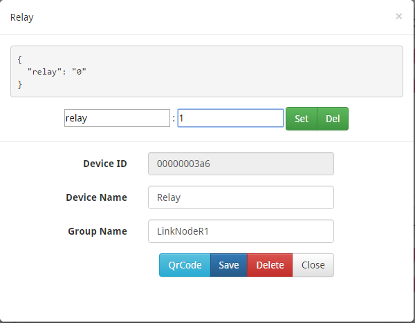

# LinkNode R1

### Introduction

LinkNode R1 is a WiFi development board which is powered by the high integrated WiFi chip [ESP-8266EX](http://espressif.com/en/products/hardware/esp8266ex/overview).

Thanks for the contribution from open source community who have developed Arduino core for ESP8266, this let Aduino IDE program LinkNode R1 without any change. At the same time, LinkNode R1 has Arduino-compatible pin out which make it very easy to connect to Arduino Sensors.


### Features

* Powered by ESP-8266EX
* 6 Digital I/O pins
* 1 Analog Input pin
* 1 Digital I/O for Relay
* 1 DC port for power/configure
* Power jack for 5V power input
* Compatible with [Arduino programming](https://github.com/pcduino/LinkNodeD1)
* ompatible with [NodeMCU](http://www.nodemcu.com/index_cn.html)
* OTA -- Wireless Upload(Program)

### Tutorials

#### 1. Get started in Arduino
If you have used Arduino before, you will feel that the LinkNode R1 is as same as Arduino, and there is no difference between their programming. The only limitation of LinkNode R1 is that it only has 6 digital ports and 1 analog input port.

##### a. Requirements

* [Arduino IDE](https://www.arduino.cc/en/Main/Software), (the latest version is 1.8.2 )
* The [Arduino core](https://github.com/pcduino/LinkNodeD1) for LinkNode D1


##### b.  Install hardware package for LinkNode R1

* Install Arduino 1.6.8 from the [Arduino website](https://www.arduino.cc/en/main/software)
* Start Arduino and go to File --> Preferences .
* Enter [http://arduino.esp8266.com/stable/package_esp8266com_index.json]() into Additional Board Manager URLs field. You can add multiple URLs, separating them with commas.


* Open Boards Manager from Tools --> Board menu --> Boards Manager.
* Search and install esp8266 platform (and don't forget to select your ESP8266 board from Tools --> Board menu after installation).


##### c. Check the configuration of Board

Because the LinkNode R1 has not been added into the offcial ESP8266 Arduino core repository yet, so you can't find LinkNode R1 board on the boards list, but you can use the WeMos D1(Retired), this board is fully compotiable with LinkNode R1.


##### d. Create a Arduino Project

* Connect LinkNode R1 with a [USB to TTL board](https://world.taobao.com/item/539013672958.htm?fromSite=main&spm=a312a.7700824.w4002-10306315219.18.O6wjHh) to your PC
* Check your serial port which your PC recognize
* Enter the following source code and click the Upload button
* Chose the Upload way and then uoloaded selecte Run way


```
const int Relay = 16;

void setup() 
{
	// initialize digital pin GPIO2/D9 as an output.
	pinMode(Relay, OUTPUT);
}

// the loop function runs over and over again forever
void loop() 
{
	digitalWrite(Relay, HIGH);   // turn the LED on (HIGH is the voltage level)
	delay(1000);              // wait for a second
	digitalWrite(Relay, LOW);    // turn the LED off by making the voltage LOW
	delay(1000);              // wait for a second
}
```

* After finish uploading, please check the Relay on the LinkNode R1, is it open or close?

#### 2. Hello World

* Take the steps above and run the following code :

```
void setup() 
{
	Serial.begin(115200);
}

// the loop function runs over and over again forever
void loop() 
{
	Serial.println("Hello world!");
	delay(1000);              // wait for a second
}

* After finish uploading, and open the Serial Monitor in Arduino IDE
* The serial will print Hello world! in every second.

```

#### 3. Connect to LinkSprite IO

[LinkSprite IO](www.linksprite.io) is an IoT platform which supports RESTful API and WebSocket. These make the mobile APP, website application or device connect it very easily. The following I will introduce is about how to use LinkNode R1 to communicate with LinkSprite IO platform.

##### a. Prepare

* Open Arduino IDE and go to Sketch --> Include Library --> Manage Libraries
* Search the wifimanager and install it
* Register to [LinkSprite.IO](wwww.linksprite.io)
* Download the [LinkSpriteIO code](https://github.com/delongqilinksprite/LinkSpriteIO.git)
* Move the code to Arduino-xxx/libraies/
* Open File -> Examples -> LinkSpriteIO -> LinkSpriteIO

##### b. Create a new account and device on LinkSprite.io

* Go to www.linksprite.io and sign up
* Enter your Email and password to create a new account
* Go to My Account to get your own API Key. The API Key is fatal because only add the Key in your codes, can the data sync to your IoTgo account.


* Click My Device, and choose Create DIY Device.


* Click the created device icon and get the DeviceID.


##### c. Update the source code using your own apikey and device ID

```
#include<LinkSpriteIO.h>

String deviceID = "xxxxxxxxxx";
String apikey = "xxxxxxxx-xxxx-xxxx-xxxx-xxxxxxxx";
const int Relay = 16;

LinkSpriteIO linksprite(deviceID,apikey);

void setup()
{
    String s;
    Serial.begin(115200);
    pinMode(Relay, OUTPUT);
    linksprite.begin();
    s = linksprite.update("relay","11111");
    Serial.println(s);
}

void loop()
{ 
    int val;
    val = linksprite.query("relay");
    Serial.println("The relay is :");
    Serial.println(val);
    if(val == 1)
      digitalWrite(Relay, HIGH); 
    if(val == 0)
      digitalWrite(Relay, HIGH); 
}
```

##### d. WiFi Manager

* After upload the program, the LinkNode D1 will create a AP called LinkNodeAP
* Use your mobile phone to connect this AP
* Open a browser and enter the ip address 10.0.1.1 and you will see the following website:

* Click the button configure WiFi
* Select your WiFi AP which you want to connect and enter your wifi password.
* If connecting failed, you can go to the same website to configure it again.
* Also, you can use Serial Monitor in Arduino IDE to check the status.


This demo will send http POST request to query the param relay on linksprite.io, if the relay is "1", then open the Relay on LinkNode R1, if "0", then close the Relay.

